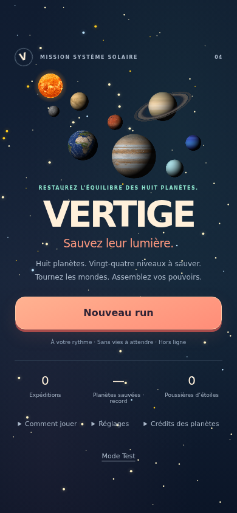

# VERTIGE — Sauvez le système solaire

Puzzle tap-blast à gravité rotative, en français, mobile et ordinateur. Éclatez des groupes,
créez des boosters et tournez le plateau pour assembler de nouvelles cascades.



## Lancer

Node.js 20 ou supérieur et npm :

```sh
npm ci
npm run dev                 # http://localhost:5174
npm run build               # version de production dans dist/
npm run preview             # http://localhost:4174
```

Servir `dist/` sur un hébergement statique HTTPS. Les chemins sont relatifs : un sous-dossier
convient également. Ne pas ouvrir index.html directement en file://.
La PWA est installable depuis les navigateurs compatibles ; une première visite en ligne complète
met les ressources en cache. Les mises à jour s'activent après fermeture des anciens onglets.
Aucun compte, aucune requête tierce à l'exécution.

## Publication automatique

Le workflow `.github/workflows/pages.yml` teste et compile le jeu, puis publie **dist/** sur GitHub Pages à chaque modification de main. Il attend la fin de l’ancien workflow Jekyll si Pages est encore configuré sur une branche, pour éviter que les sources remplacent le build.

Après une mise à jour, fermer tous les onglets du jeu (et l’application installée), puis rouvrir : le cache hors ligne conserve volontairement la version d’une partie ouverte. Ne pas effacer les données du site, qui contiennent les sauvegardes. Pour découvrir la nouvelle campagne, démarrer un nouveau run ; une ancienne sauvegarde garde ses règles.

## Jouer

- Tapez au moins deux gemmes voisines de même couleur. Une spéciale seule peut aussi être activée.
- Groupes de 4 / 6 / 7 / 10 : bombe / ligne / croix / bombe de couleur.
- Tournez à gauche, à droite ou d'un demi-tour. Maintenez la commande pour prévisualiser la chute.
- Une rotation consomme une énergie ; à jauge vide, un coup. Les groupes de 6+ rechargent l'énergie.
- Un nouveau groupe de 6+ assemblé par la chute d'une rotation déclenche une cascade ; une grappe
  qui glisse sans changer ne se déclenche pas. Maximum quatre vagues par résolution.
- Si aucun tap ni rotation ne peut aider, une paire ou une bombe est offerte, sans coût ni points.
- Huit planètes, trois niveaux chacune : découverte, défi et sauvetage final, soit 24 niveaux.
- Choisissez une carte entre les niveaux, jamais pendant le jeu. Le build reste acquis dans l’expédition.
- Le rang des cartes dépend de l’XP active : plafond I sur Mercure/Vénus, II de la Terre à Jupiter, III à partir de Saturne.
- Chaque sauvetage final demande de guider deux noyaux vers la sortie avec la gravité.
- Les planètes réalistes, lunes et soleil tournent avec le plateau ; les textures sont embarquées pour jouer hors ligne.
- Le bouton Menu sauvegarde la partie. Continuer restaure le plateau, les pouvoirs et le hasard.
- Réglages séparés : effets sonores, ambiance musicale (désactivée initialement), vibrations.
- Clavier : Q / D / S pour tourner ; avec le plateau sélectionné par Tab, flèches puis Entrée pour jouer.

Le mode Test permet de sélectionner salle, pouvoirs, seed, difficulté, gravité et cascades.
Les anciennes sauvegardes conservent leurs anciennes règles jusqu'au prochain run.

## Vérifier

```sh
npm test
npm run sim:solar -- 40
npx playwright install chromium
npm run smoke -- --chapitre  # premier chapitre par vrais clics
npm run smoke:shot           # partie complète par vrais clics, captures dans /tmp/vertige-shots
npm run qa:mobile            # 4 résolutions, tactile, souris, sauvegarde, reprise hors ligne
```

`CHROMIUM_PATH` peut désigner un Chromium déjà installé. `SHOT_DIR` permet de changer le dossier
des captures. Pour un serveur existant, `QA_URL` remplace celui lancé automatiquement par qa:mobile.

## Architecture et ressources

- `src/moteur/` : logique déterministe indépendante du DOM et journal d'événements.
- `src/data/` : salles, seuils, pouvoirs et palette. Ajouter un niveau dans `salles.js`, puis son ID à l'ordre.
- `src/rendu/` : Canvas 2D, atlas de sprites pré-rendus, chutes, particules et finales.
- `src/ui/` : menus HTML accessibles, illustration planétaire texturée, HUD et cartes.
- `src/audio/` : sons et ambiance générés localement via Web Audio.
- `src/persistence.js` : stockage tolérant aux erreurs et migration des préférences.
- `vite.config.js`, `public/` : manifeste, icônes originales et génération du cache hors ligne.

Vite et Playwright sont les seules dépendances de développement. Aucune bibliothèque de rendu
supplémentaire : le moteur Canvas existant sépare déjà les règles du rendu, utilise des sprites
mis en cache et ne nécessite pas de migration WebGL pour cette taille de plateau.

Campagne 0.4, équilibrage et validation : [docs/CHAPITRES_2026-09-16.md](docs/CHAPITRES_2026-09-16.md).

Textures planétaires : Solar System Scope / INOVE, CC BY 4.0. Voir les [crédits et adaptations](public/CREDITS_PLANETES.md) et la [traçabilité des fichiers](docs/SOURCES_PLANETES.json). Ces cartographies composites sont projetées sur des sphères éclairées ; la composition n’est pas à l’échelle astronomique.

Historique de la campagne à huit salles : [docs/EXPEDITION_SOLAIRE.md](docs/EXPEDITION_SOLAIRE.md).

Bilan initial, charte, ressources et limites : [docs/REFONTE_2026-09-16.md](docs/REFONTE_2026-09-16.md).
Cette version est une base web jouable ; elle n'est pas encore validée pour les stores.
